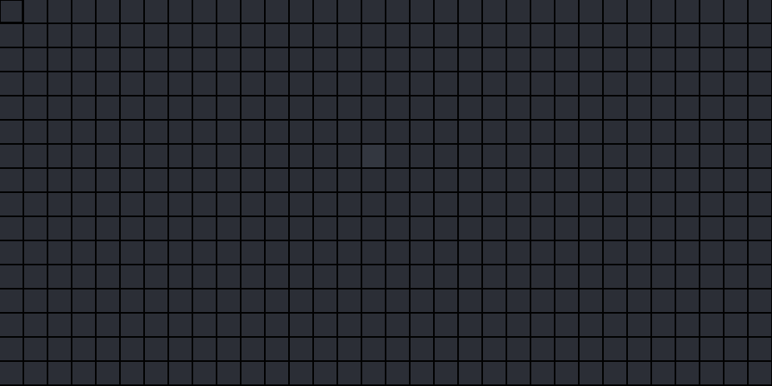

# Minesweeper-PSH
> Minesweeper written in Powershell 

## How to play:
* Left click to dig
* Right click to flag tile as a bomb

## Contributing

Pull requests are welcome! For major changes, please open an issue first
to discuss what you would like to change.

## License

[MIT](https://choosealicense.com/licenses/mit/)
